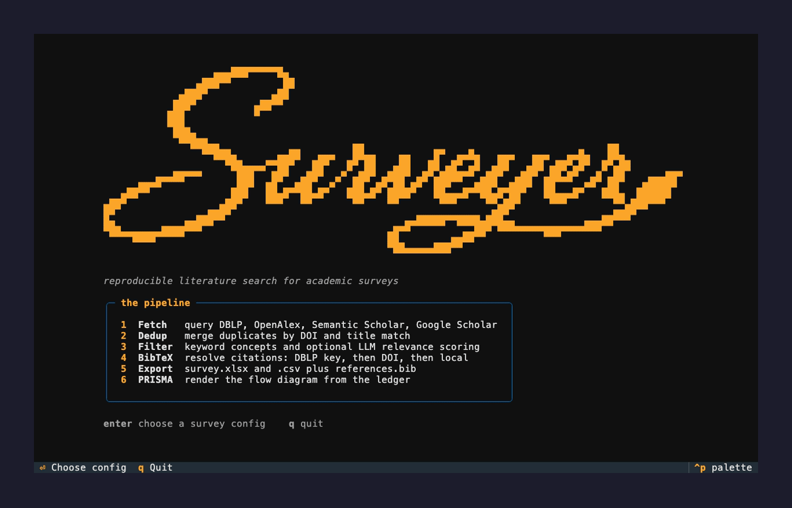

<div align="center">
  
</div>

<br>

<p align="center">
  <a href="https://www.python.org/downloads/"></a>
  <a href="https://docs.astral.sh/uv/"></a>
  <a href="https://github.com/IsmailHatim/Surveyer/releases"></a>
  
  <a href="https://github.com/IsmailHatim/Surveyer/stargazers"></a>
  <a href="https://github.com/IsmailHatim/Surveyer/commits"></a>
  <a href="https://github.com/IsmailHatim/Surveyer/actions/workflows/ci.yml"></a>
</p>

<div align="center">
  
  <p><em>The built-in terminal dashboard: pick a config, tweak it, run the pipeline live.</em></p>
</div>

Surveyer is an open-source literature-search tool for academic surveys: fetch from
multiple sources, deduplicate, filter (keyword and LLM relevance), export to Excel
with ready-to-use BibTeX citations, and generate a PRISMA flow diagram.
It's reproducible and based on configuration files, so you can easily update your
survey as new papers come out or share it with collaborators.

## Install

```bash
uv sync
# optional Google Scholar support:
uv sync --extra scholar
# optional local LLM scoring via Ollama:
uv sync --extra ollama
# optional TUI dashboard (textual + tomlkit):
uv sync --extra tui
```

## Run

### Terminal dashboard (easiest)

```bash
uv run surveyer                              # home screen → pick a config → edit → run
uv run surveyer -c examples/survey.toml      # open a config directly
# with credentials from .env:
uv run --env-file .env surveyer
```

Everything is driven by a few keys:

| Key | Action |
|-----|--------|
| `Enter` | choose a survey config |
| `S` | save the config (validated first, comments preserved) |
| `c` | edit search/filter concept blocks in-app |
| `E` | open the TOML in `$EDITOR` |
| `R` / `F` | run the full pipeline or fetch-only, with live logs and a PRISMA summary |
| `Esc` | back, or cancel a running pipeline |
| `O` | open the output folder (xlsx, references.bib, PRISMA figure) |
| `Q` | quit |

Check the **Refresh** checkbox before running to bypass the HTTP cache and refetch
sources and BibTeX.

### Command line

```bash
# Full run creates: runs/<name>/survey.xlsx, references.bib, ledger.json, prisma.{svg,pdf,png,mmd}
uv run surveyer run --config examples/survey.toml

# Fetch and deduplicate only (skips BibTeX resolution)
uv run surveyer fetch --config examples/survey.toml

# Render PRISMA from a saved ledger
uv run surveyer prisma --config examples/survey.toml

# Search new queries on top of a manually screened survey.xlsx
uv run surveyer extend --config examples/survey_v2.toml

# Chase citations (snowballing) from a screened survey.xlsx
uv run surveyer snowball --config examples/survey.toml --papers runs/v1/survey.xlsx

# Bypass the HTTP cache and refetch (works on run, fetch and extend)
uv run surveyer run --config examples/survey.toml --refresh
```

## Configure

Copy `examples/survey.toml` and edit it for your survey (sources, query groups,
year range, keyword include/exclude, and your survey abstract for LLM scoring).

Set credentials in your environment:

```bash
export OPENAI_API_KEY=sk-...
export SEMANTIC_SCHOLAR_API_KEY=...   # strongly recommended
export NCBI_API_KEY=...               # optional
```

Or keep them in the `.env` file and load it automatically:

```bash
uv run --env-file .env surveyer run --config examples/survey.toml
```

### Concept groups

Rather than handwriting every keyword combination, you can declare concept blocks of
synonyms. Synonyms within a concept are OR statements. `[search.concepts]` expands the
cross-product into queries, while `[filter.concepts]` screens records against the concepts
(an `exclude` term always drops a record). The two are independent, so you can do a vast
search but keep only the records that cover your concepts.

How many concept blocks a record must match in the keyword stage is set by
`[filter] concept_mode`:

- `any` (default) — match **≥1** concept. Keeps the keyword stage as a cheap pre-filter and
  lets the LLM do the real relevance judging (best recall).
- `all` — match **every** concept (strict AND-gate).
- `min:N` — match **≥N** concepts.

```toml
[search.concepts]   # [filter.concepts] works the same way
federated = ["federated learning", "federated averaging"]
security  = ["secure aggregation", "model poisoning", "byzantine robust"]
privacy   = ["differential privacy", "privacy preserving"]

[filter]
concept_mode = "any"   # any | all | min:N
```

Generated queries are added to any explicit `[[search.queries]]`. 
In the dashboard, edit both blocks in-app with `c`: no
manual TOML required. See `examples/survey.toml` for a complete example.

### LLM scoring provider

LLM relevance scoring runs through `filter.llm`. Two providers are supported:

- `openai` (default) - set `OPENAI_API_KEY`.
- `ollama` - runs a local or networked [Ollama](https://ollama.com) model, no
  API key needed. Install the extra (`uv sync --extra ollama`), then set
  `provider = "ollama"`, the `model` name, and `host` (default
  `http://localhost:11434`).

Each record scores 0–1 against your survey abstract; those below `threshold` are excluded.
Set `[filter.llm] review_margin` to open a **borderline** band: records scoring in
`[threshold - margin, threshold)` are kept and flagged `borderline` in the `papers` sheet's
`status` column for manual review (`0` = off). Per-concept verdicts (`yes`/`partial`/`no`)
are exported as `concept: <name>` columns so a score is auditable.

## Extend a screened survey

After a run, you can check `survey.xlsx` by hand: move rows between the
`papers` and `excluded` sheets, add papers you found on your own, color cells or
leave comments. Then, to search for *additional* studies later (new queries or
keywords) without redoing that work, point a new config at the screened
workbook:

```toml
[extend]
xlsx = "runs/v1/survey.xlsx"   # the manually screened workbook

[project]
output_dir = "runs/v2"         # must differ from the v1
```

Your manual decisions are final: `papers` rows stay included, `excluded` rows
stay excluded, and re-found records are dropped as `already_screened`.
Filters apply only to newly discovered papers.

The output `survey.xlsx` is a **copy** of your screened file with new rows appended, missing
BibTeX is backfilled, and the PRISMA diagram switches to the 2020 review-update layout
(previous-version box and cumulative total). Requires `export_format = "xlsx"`.

## Must-cite seeds

Some papers are must cite: the foundational works your survey *has* to cite,
even if a keyword rule or the LLM judge would otherwise filter them out. List their
DOIs or Semantic Scholar ids under `[seed]` and Surveyer resolves and **pins** them
into the corpus, bypassing the keyword and LLM filters:

```toml
[seed]
ids = ["10.1145/3394486.3403182", "arXiv:2409.07825", "CorpusID:268417919"]
```

A seed that your search also turns up is counted once, and seeds feed
the snowball arm if enabled so the tool chases citations around them too. The PRISMA diagram
shows a parallel *must-cite* arm that joins the shared total; unresolved ids warn
without failing the run.

## Snowball (citation chasing)

Beyond keyword search, you can find related work by following citations from the
papers you already included. Enable the `[snowball]` block to chase, for each
included paper, the works it **cites** (backward), the works that **cite it**
(forward), or `both`:

```toml
[snowball]
enabled = true
direction = "both"            # backward | forward | both
max_results_per_seed = 200    # cap per direction, per seed
```

Candidates are deduplicated (against each other and the main results) and screened
through the same keyword and LLM filters, so only relevant citations survive. The
PRISMA diagram gains a parallel *identification via citation searching* arm that
joins the keyword arm at the shared total. Snowballing runs inline during
`surveyer run` (seeds = the included set), or standalone from a screened workbook:

```bash
uv run surveyer snowball --config examples/survey.toml --papers runs/v1/survey.xlsx
```

Citation data comes from OpenAlex (depth 1: newly found papers are not themselves
re-snowballed). The `[snowball]` knobs are also editable in the dashboard.

## Sources

| Source            | API key | Notes                                   |
|-------------------|---------|-----------------------------------------|
| DBLP              | no      | CS bibliography                         |
| OpenAlex          | no      | broad coverage, abstracts               |
| Semantic Scholar  | recommended | abstracts, citations                |
| PubMed            | recommended | biomedical and MEDLINE; abstracts + MeSH keywords |
| Google Scholar    | no      | optional extra; fragile, off by default |
| Agent web search  | -       | TODO                                    |

## Outputs

- `survey.xlsx` - `papers`, `excluded`, `summary`, and `retrieval` sheets.
- `references.bib` - one BibTeX entry per included paper.
- `ledger.json` - per-stage counts (the input to PRISMA).

### Search completeness

For every source and query, Surveyer records how many results it **requested**,
how many it actually **retrieved**, and the database's own **reported total** when
the API exposes one. This lands in the `retrieval` sheet (and `retrieval.csv`), so
you can tell when a source was capped below its full match count and may have
missed papers — then bump `max_results_per_query` for those sources. The dashboard
also warns when a search looks truncated.

### BibTeX citations

`surveyer run` resolves a BibTeX entry for every included paper and writes them
to `references.bib`. Each citation also appears in a `bibtex` column of the
`papers` sheet (and `papers.csv`), so you can copy a single citation directly
from the sheet.

Entries are fetched from authoritative sources rather than synthesized, in
this priority order:

| `bibtex_source` | Where it comes from |
|-----------------|---------------------|
| `dblp` | DBLP's curated entry (`dblp.org/rec/<key>.bib`) preferred |
| `doi` | CrossRef/DataCite via DOI content negotiation |
| `local` | Minimal `@misc` built from the record's own metadata |

`local` entries are a last resort for papers with neither a DBLP key nor a DOI.
They are highlighted red in the `.xlsx` so you can spot and hand-fix lower-quality citations. 
Fetched entries are cached under the `cache/` directory, so you can re run without extra requests.

### PRISMA flow diagram

The pipeline writes a PRISMA flow diagram to the run's output directory:

| File | Description |
|------|-------------|
| `prisma.svg` / `prisma.pdf` / `prisma.png` | Publication figure (requires Graphviz) |
| `prisma.mmd` | Mermaid source rendered natively by GitHub and most IDEs |

The image outputs require the Graphviz binary:

```bash
# macOS
brew install graphviz
# Debian/Ubuntu
apt-get install graphviz
```

Without the binary the run still writes `prisma.mmd` and `prisma.dot` (the raw
diagram source) and logs a warning.

## License

Released under the [MIT License](LICENSE) © 2026 Ismail Hatim.
